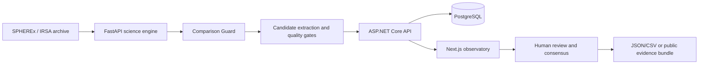

# PARALLAX — The Living Sky Observatory

> **The sky is not a picture. It is a movie.**

PARALLAX is an evidence-first observatory for repeated sky observations. It helps researchers, educators, and citizen reviewers compare epochs, separate real residuals from detector artifacts, preserve provenance, and decide what deserves human review.

It is designed around one rule: **a candidate is not a discovery**.

## Live release

- **Public observatory:** [parallax-living-sky-observatory.kitgiz-1946.chatgpt.site](https://parallax-living-sky-observatory.kitgiz-1946.chatgpt.site)
- **Judge Brief:** `/parallax-x`
- **Guided investigation:** `/demo`
- **Evidence explorer:** `/explore`
- **Citizen review:** `/citizen-science`
- **Classroom pilot:** `/classroom`

The hosted judge build is a static, read-only presentation of the validated demo path. The full SQL-backed processing stack is available through Docker Compose for local or self-hosted deployment.

## Why PARALLAX exists

Time-domain astronomy finds meaning in change: movement, fading, brightening, and unexpected residuals across repeated observations. The same comparison can also be fooled by bad pixels, cosmic rays, incomplete coverage, registration error, or low signal-to-noise.

PARALLAX makes that reasoning visible:

1. **Observe** — identify the source, epochs, bands, and archive provenance.
2. **Compare** — register observations and compute measured differences.
3. **Reject artifacts** — apply quality gates before promotion.
4. **Cross-band verify** — preserve independent band evidence and cautious associations.
5. **Send to human review** — export a traceable handoff instead of making a discovery claim.

## What the platform delivers

- Repeated-epoch blink, split, difference, residual, and candidate-overlay views.
- Comparison Guard for incompatible observations, coverage failures, flags, variance, and registration quality.
- Deterministic synthetic validation data with explicit `DEMONSTRATION DATASET` labels.
- Real SPHEREx/IRSA cutout inspection with provenance and bounded archive fallback.
- Parallel multi-band analysis with WCS-aware, cautious cross-band candidate associations.
- Asynchronous analysis lifecycle: `queued → processing → complete` or `failed`.
- Retry/backoff, timeouts, rate limits, short-lived result caching, and graceful archive fallback.
- Evidence JSON/CSV export, processing benchmarks, public read-only evidence bundles, and shareable query URLs.
- Bilingual core interface: English + বাংলা.
- Citizen, Teacher, and Researcher modes with keyboard-first accessibility and reduced-motion support.
- Classroom lesson mode, persisted pilot feedback, and reviewer consensus reporting.
- PostgreSQL persistence, background job polling, health/readiness endpoints, structured errors, API authentication options, and Prometheus-style metrics.
- Android and desktop shells that open the public observatory deployment.

## Architecture



The science service owns registration, differencing, measurement, and candidate extraction. The API owns validation, persistence, background jobs, authentication boundaries, rate limiting, metrics, and provenance. The web app never turns a display preview into a measurement or collapses evidence into an unsupported probability score.

## Repository map

```text
apps/web              Next.js + TypeScript observatory interface
apps/api              ASP.NET Core API, EF Core persistence, migrations
services/science      FastAPI science engine and deterministic demo pipeline
mobile                Capacitor Android shell
desktop               Electron desktop shell and packaging scripts
data/demo             Explicitly labelled synthetic demo assets
docs                  Product, architecture, and capture notes
tests/api             ASP.NET integration tests
tests/science         FastAPI scientific-engine tests
scripts               Backup, restore, validation, and release utilities
```

## Requirements

- Node.js 20.11+ and pnpm 9+
- .NET SDK 10+
- Python 3.11+
- Docker Desktop 4.x+ for the production-shaped local stack

For Android packaging, use Java 21 and Android SDK platform 35. For macOS desktop packaging, Electron Builder produces unsigned `.dmg` and `.zip` artifacts unless an Apple Developer signing identity is configured.

## Run locally

Install JavaScript dependencies:

```bash
pnpm install
```

Start the web app:

```bash
pnpm dev:web
```

In a second terminal, start the API:

```bash
pnpm dev:api
```

In a third terminal, create the science environment and start the science service:

```bash
python3 -m venv .venv
source .venv/bin/activate
pip install -r services/science/requirements.txt
python3 -m uvicorn app.main:app --app-dir services/science --reload --port 8001
```

Open:

- Web: <http://localhost:3000/explore>
- API health: <http://localhost:5080/health>
- Science health: <http://localhost:8001/health>
- API Swagger: <http://localhost:5080/swagger>

If the API or science service is unavailable, `/explore` and `/demo` use the checked-in, read-only precomputed artifact. That fallback is visibly labelled and cannot persist classifications or claim community consensus.

## One-command PostgreSQL stack

The Compose stack starts PostgreSQL, the science service, the API, and the web app with health-gated dependencies:

```bash
cp .env.example .env
# Replace POSTGRES_PASSWORD with a strong local value.
docker compose up --build
```

Open <http://localhost:3000>. Stop the stack with `Ctrl-C`.

To intentionally remove the local database volume:

```bash
docker compose down -v
```

The API uses PostgreSQL in Compose and SQLite remains available as a local development profile. Do not use the sample development secrets in a public deployment.

## Verification

```bash
pnpm lint:web
pnpm test
pnpm test:api
pnpm test:science
pnpm test:e2e
dotnet build apps/api/Parallax.Api.csproj
python3 -m compileall services/science
```

The release path includes Playwright browser smoke coverage, science-engine regression tests, API integration tests, type checking, and deterministic demo asset generation.

## Android app

The Capacitor shell is in [`mobile/`](./mobile). It opens the verified public observatory URL and requires an internet connection.

```bash
cd mobile
pnpm install --ignore-workspace
pnpm exec cap sync android
pnpm run apk:debug
```

The installable debug APK is generated at:

```text
mobile/android/app/build/outputs/apk/debug/app-debug.apk
```

This is an installable debug build, not a Play Store release signed with a production keystore.

## Desktop app

The Electron shell is in [`desktop/`](./desktop). It is configured for macOS, Windows, and Linux packaging:

```bash
cd desktop
pnpm install --ignore-workspace
pnpm start
pnpm dist:mac
pnpm dist:win
pnpm dist:linux
```

The desktop shell uses `contextIsolation`, disables Node integration in the renderer, restricts permission requests, and opens external HTTPS links outside the application window.

## Scientific boundaries

PARALLAX is a candidate-triage and evidence-review system, not a discovery pipeline or survey-completeness claim.

- Synthetic demo ground truth is used only beside the generator for test evaluation.
- Processing endpoints never receive generator-only ground truth.
- Real archive analysis is bounded and exploratory.
- Registration is currently translation-based; full WCS distortion and instrument-specific PSF fitting remain future work.
- A null result is preserved as a valid outcome.
- `MULTI-BAND CONSISTENT` means the selected evidence passed the current comparison gates; it does not mean the object is confirmed.
- `SINGLE-BAND ONLY`, `COMPARISON BLOCKED`, and `NO PROMOTED RESIDUAL` remain first-class outcomes.

Read the detailed notes in [SCIENCE.md](./SCIENCE.md), [VALIDATION.md](./VALIDATION.md), and [DATA_PROVENANCE.md](./DATA_PROVENANCE.md).

## Operations and deployment

The production-shaped API includes:

- PostgreSQL migrations and backup/restore scripts.
- Background processing and bounded job polling.
- Optional API-key/Bearer authentication.
- IP-partitioned rate limiting.
- `/health`, `/health/ready`, structured trace IDs, and operational metrics.
- CI and browser E2E coverage in the repository workflow.

Hosted deployments still require platform-specific TLS, WAF/ingress, secret management, alerting, and a production signing/notarization setup for store distribution.

## Data, privacy, and disclosure

The classroom and research-feedback surfaces store aggregate pilot signals rather than exact location or identity. Public evidence bundles are read-only and expiration-bounded.

AI-assisted tools were used during software development and copy editing. NASA/SPHEREx data, numerical measurements, validation fixtures, and candidate interpretations are loaded or calculated by the documented pipeline; they are not generated by an AI model. Real archive credit belongs to NASA/IPAC IRSA and the SPHEREx mission documentation.

## Further reading

- [Architecture](./ARCHITECTURE.md)
- [Setup and operations](./SETUP.md)
- [Demo script](./DEMO_SCRIPT.md)
- [Judge handoff](./JUDGE_HANDOFF.md)
- [Final release checklist](./FINAL_RELEASE_CHECKLIST.md)
- [Screenshot capture notes](./docs/screenshots.md)

## Project guardrails

1. Measurements and interpretations stay separate.
2. Candidate language is used for anything requiring verification.
3. Demonstration records are always labelled.
4. The science service is the only image-registration and candidate-detection boundary.
5. Provenance stays attached to every reviewable evidence path.
